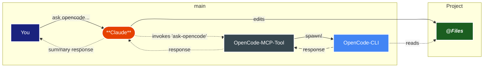

# How It Works

## Natural Language Workflow Integration

The opencode-mcp-tool is designed to seamlessly integrate into your natural workflow with your preferred MCP compliant AI clients, achieved through carefully crafted tools and pipelines.

Claude automatically decides when to use `ask-opencode` based on context:

- `🔍 comparative analysis` - different AI perspectives for validation
- `🛠️ leveraging extra tools` - OpenCode's search and memory functions  
- `📋 code review & big changes` - second opinions on implementation
- `💡 creative problem solving` - brainstorming and ideation

This intelligent selection enhances your workflow exactly when OpenCode's capabilities add value.

⇣ when ask-opencode gets called ↴

<DiagramModal>

</DiagramModal>
